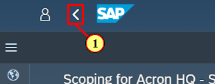

## Setup the Project \(2\)

The project lead sets up the project and monitors its all\-over progress. He performs basic activities like entering the project name and milestones, creating companies and assign the business areas and assigning project members to their roles. He could also perform the more details process scoping and picks the scope items in scope for the project.

 

Duration: 5 min

[ACCORDION-BEGIN [Step 1: ](Implementation Portal for SAP S/4HANA Cloud)]

\(1\) Click  **Define Implementation Project Name and Set Milestones ** .

[ACCORDION-END]

[ACCORDION-BEGIN [Step 2: ](Implementation Portal for SAP S/4HANA Cloud)]

\(1\) Click  **Open Application ** .

[ACCORDION-END]

[ACCORDION-BEGIN [Step 3: ](Implementation Portal for SAP S/4HANA Cloud)]

\(1\) The  **Project Name **  field is filled out.

\(2\) The  **End of Prepare Phase **  field is filled out.

\(3\) The  **End of Explore Phase **  field is filled out.

\(4\) The  **End of Realize Phase **  field is filled out.

\(5\) The  **End of Deploy Phase **  field is filled out.

\(6\) The  **Start of Production \(Run Phase\) **  field is filled out.

[ACCORDION-END]

[ACCORDION-BEGIN [Step 4: ](Implementation Portal for SAP S/4HANA Cloud)]

\(1\) Click  .

[ACCORDION-END]

[ACCORDION-BEGIN [Step 5: ](Implementation Portal for SAP S/4HANA Cloud)]

\(1\) Click  **Status:Open ** .

\(2\) Set Status to  **Done**  .

\(3\) Click  .

[ACCORDION-END]

[ACCORDION-BEGIN [Step 6: ](Implementation Portal for SAP S/4HANA Cloud)]

\(1\) Click  **Set High Level Project Scope ** .

[ACCORDION-END]

[ACCORDION-BEGIN [Step 7: ](Implementation Portal for SAP S/4HANA Cloud)]

\(1\) Click  **Open Application ** .

[ACCORDION-END]

[ACCORDION-BEGIN [Step 8: ](Implementation Portal for SAP S/4HANA Cloud)]

\(1\) Enter  **Acron HQ**  as Company.

\(2\) Select " **USA** " as country version.

[ACCORDION-END]

[ACCORDION-BEGIN [Step 9: ](Implementation Portal for SAP S/4HANA Cloud)]

\(1\) Click  for "Finance" to set it in scope.

Please repeat the steps and make sure that Finance, Human Resources, Manufacturing, and Sales are all set in scope. 

 

[ACCORDION-END]

[ACCORDION-BEGIN [Step 10: ](Implementation Portal for SAP S/4HANA Cloud)]

\(1\) Click   to confirm your high\-level scoping.

[ACCORDION-END]

[ACCORDION-BEGIN [Step 11: ](Implementation Portal for SAP S/4HANA Cloud)]

\(1\) Click   to add a second company.

[ACCORDION-END]

[ACCORDION-BEGIN [Step 12: ](Implementation Portal for SAP S/4HANA Cloud)]

Add the second company like you added the first one. The name of the second company is "Acron Sales \(DE, FR\)" and it uses the country version "Germany". The company implements the business areas "Finance" and "Sales".

 

After you added the second company the screen should look like this one.

 

[ACCORDION-END]

[ACCORDION-BEGIN [Step 13: ](Implementation Portal for SAP S/4HANA Cloud)]

\(1\) Click  .

[ACCORDION-END]

[ACCORDION-BEGIN [Step 14: ](Implementation Portal for SAP S/4HANA Cloud)]

\(1\) Click  **Status:Open ** .

\(2\) Set the task to  **Done ** .

[ACCORDION-END]

[ACCORDION-BEGIN [Step 15: ](Implementation Portal for SAP S/4HANA Cloud)]

\(1\) Click  .

[ACCORDION-END]

[ACCORDION-BEGIN [Step 16: ](Implementation Portal for SAP S/4HANA Cloud)]

\(1\) Click  **Assign Team Members ** .

[ACCORDION-END]

[ACCORDION-BEGIN [Step 17: ](Implementation Portal for SAP S/4HANA Cloud)]

\(1\) Click  **Open Application ** .

[ACCORDION-END]

[ACCORDION-BEGIN [Step 18: ](Implementation Portal for SAP S/4HANA Cloud)]

\(1\) Click  **Edit ** .

[ACCORDION-END]

[ACCORDION-BEGIN [Step 19: ](Implementation Portal for SAP S/4HANA Cloud)]

Please maintain the project team:

-   **you as Adrian Kelly \- Project Lead and Business Process Expert** 
-   **Quinn Kendall \- Configuration Expert** 
-   **Charlie Spencer \- Integration Implementation Expert** 
-   **Paker Payton \- Output Management and Forms Expert** 
-   **Riley Reese \- System Administrator and System Architect** 
-   **Taylor Harley \- Testing Expert** 

#

 

\(1\) Click  **Save and Assign Tasks ** .

[ACCORDION-END]

[ACCORDION-BEGIN [Step 20: ](Implementation Portal for SAP S/4HANA Cloud)]

\(1\) Click  .

[ACCORDION-END]

[ACCORDION-BEGIN [Step 21: ](Implementation Portal for SAP S/4HANA Cloud - Google Chrome)]

\(1\) Click  **Status:Open ** .

\(2\) Set task to  **Done ** .

[ACCORDION-END]

[ACCORDION-BEGIN [Step 22: ](Implementation Portal for SAP S/4HANA Cloud - Google Chrome)]

\(1\) Click  .

[ACCORDION-END]

[ACCORDION-BEGIN [Step 23: ](Implementation Portal for SAP S/4HANA Cloud - Google Chrome)]

\(1\) Click  **Set Process Scope \- Finance ** .

[ACCORDION-END]

[ACCORDION-BEGIN [Step 24: ](Implementation Portal for SAP S/4HANA Cloud - Google Chrome)]

\(1\) Click  **Open Application ** .

[ACCORDION-END]

[ACCORDION-BEGIN [Step 25: ](Implementation Portal for SAP S/4HANA Cloud - Google Chrome)]

\(1\) Click   to set process Accounting and Financial Close \(J58\) in scope.

Please also set processes J60 and J59 in scope.

 

[ACCORDION-END]

[ACCORDION-BEGIN [Step 26: ](Implementation Portal for SAP S/4HANA Cloud - Google Chrome)]

\(1\) Click  **Status:Open ** .

\(2\) Click  **Done ** .

\(3\) Click  .

[ACCORDION-END]

[ACCORDION-BEGIN [Step 27: ](Implementation Portal for SAP S/4HANA Cloud - Google Chrome)]

\(1\) Click  **Set Process Scope \- Finance ** .

[ACCORDION-END]

[ACCORDION-BEGIN [Step 28: ](Implementation Portal for SAP S/4HANA Cloud - Google Chrome)]

\(1\) Click  **Open Application ** .

[ACCORDION-END]

[ACCORDION-BEGIN [Step 29: ](Implementation Portal for SAP S/4HANA Cloud - Google Chrome)]

\(1\) Click   to set process Accounting and Financial Close \(J58\) in scope.

Please also set processes J60 and J59 in scope.

 

[ACCORDION-END]

[ACCORDION-BEGIN [Step 30: ](Implementation Portal for SAP S/4HANA Cloud - Google Chrome)]

\(1\) Click  **Status:Open ** .

\(2\) Click to set task to  **Done ** .

\(3\) Click  .

[ACCORDION-END]

[ACCORDION-BEGIN [Step 31: ](Implementation Portal for SAP S/4HANA Cloud - Google Chrome)]

\(1\) Click  **Process Scope \- Human Ressources ** .

[ACCORDION-END]

[ACCORDION-BEGIN [Step 32: ](Implementation Portal for SAP S/4HANA Cloud - Google Chrome)]

\(1\) Click  **Open Application ** .

[ACCORDION-END]

[ACCORDION-BEGIN [Step 33: ](Implementation Portal for SAP S/4HANA Cloud - Google Chrome)]

\(1\) Click   to set process JB1 in scope.

\(2\) Click  to set process 1NL in scope.

\(3\) Click  .

[ACCORDION-END]

[ACCORDION-BEGIN [Step 34: ](Implementation Portal for SAP S/4HANA Cloud - Google Chrome)]

\(1\) Click  .

\(2\) Click to set task to .

\(3\) Click  .

[ACCORDION-END]

[ACCORDION-BEGIN [Step 35: ](Implementation Portal for SAP S/4HANA Cloud - Google Chrome)]

\(1\) Click  **Set Process Scope \- Sales ** .

[ACCORDION-END]

[ACCORDION-BEGIN [Step 36: ](Implementation Portal for SAP S/4HANA Cloud - Google Chrome)]

\(1\) Click  **Open Application ** .

[ACCORDION-END]

[ACCORDION-BEGIN [Step 37: ](Implementation Portal for SAP S/4HANA Cloud - Google Chrome)]

\(1\) Click and  **Search ** stock to find process "Sell from Stock \(BD9\)".

\(2\) Set process "Sell from Stock \(BD9\)" in scope.

[ACCORDION-END]

[ACCORDION-BEGIN [Step 38: ](Implementation Portal for SAP S/4HANA Cloud - Google Chrome)]

\(1\) Click  .

[ACCORDION-END]

[ACCORDION-BEGIN [Step 39: ](Implementation Portal for SAP S/4HANA Cloud - Google Chrome)]

\(1\) Click  **Status:Open ** .

\(2\) Click  **75% ** .

\(3\) Click  .

[ACCORDION-END]

[ACCORDION-BEGIN [Step 40: ](Implementation Portal for SAP S/4HANA Cloud - Google Chrome)]

\(1\) Click  **Set Process Scope \- Sales ** .

For "Acron Sales \(DE, FR\)" please ensure that the Sales process "Sell from Stock \(BD9\)" is in scope.

After the scoping please set task "Set Process Scope \- Sales" for "Acron Sales \(DE, FR\)" to 75%.

 

For "Acron HQ" please ensure that the Manufacturing process "Make to stock production \- Discrete Manufacturing \(BJ5\)" is in scope.

After the scoping please set task "Set Process Scope \- Manufacturing" to 75%.

 

[ACCORDION-END]

[ACCORDION-BEGIN [Step 41: ](Implementation Portal for SAP S/4HANA Cloud - Google Chrome)]

\(1\) Click   to open the task list.

[ACCORDION-END]

[ACCORDION-BEGIN [Step 42: ](Implementation Portal for SAP S/4HANA Cloud - Google Chrome)]

\(1\) Click in the ** Phase section "Prepare" ** in the diagram.

[ACCORDION-END]

[ACCORDION-BEGIN [Step 43: ](Implementation Portal for SAP S/4HANA Cloud - Google Chrome)]

\(1\) Click  .

[ACCORDION-END]

[ACCORDION-BEGIN [Step 44: ](Implementation Portal for SAP S/4HANA Cloud - Google Chrome)]

\(1\) Click  **Select ** .

[ACCORDION-END]

[ACCORDION-BEGIN [Step 45: ](Implementation Portal for SAP S/4HANA Cloud - Google Chrome)]

\(1\) Click   ** to select all tasks** .

\(2\) Click  **Edit Selection ** .

[ACCORDION-END]

[ACCORDION-BEGIN [Step 46: ](Implementation Portal for SAP S/4HANA Cloud - Google Chrome)]

\(1\) Set status to done.

\(2\) Click  **Save ** .

[ACCORDION-END]

[ACCORDION-BEGIN [Step 47: ](Implementation Portal for SAP S/4HANA Cloud - Google Chrome)]

\(1\) Click  .

[ACCORDION-END]

[ACCORDION-BEGIN [Step 48: ](Implementation Portal for SAP S/4HANA Cloud - Google Chrome)]

\(1\) Click  **Finance in the Acron HQ section** .

[ACCORDION-END]

[ACCORDION-BEGIN [Step 49: ](Implementation Portal for SAP S/4HANA Cloud - Google Chrome)]

\(1\) Click  .

[ACCORDION-END]

[ACCORDION-BEGIN [Step 50: ](Implementation Portal for SAP S/4HANA Cloud - Google Chrome)]

\(1\) Click  .

[ACCORDION-END]

[ACCORDION-BEGIN [Step 51: ](Implementation Portal for SAP S/4HANA Cloud - Google Chrome)]

\(1\) Set Phase to "Explore".

\(2\) Click  .

[ACCORDION-END]

[ACCORDION-BEGIN [Step 52: ](Implementation Portal for SAP S/4HANA Cloud - Google Chrome)]

Check whether you switched successfully to "Explore" phase.

 

[ACCORDION-END]

